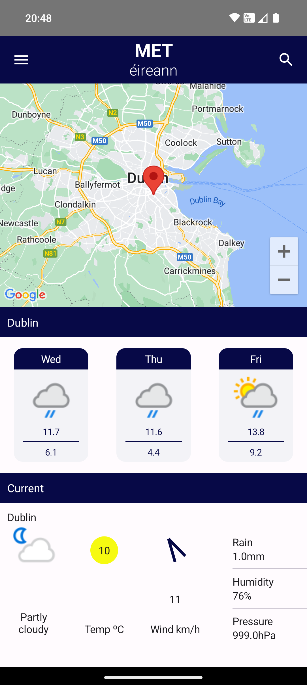

# Met Eireann Clone

## Features
* Android Weather App built using Jetpack compose
* Clone of the features I like from [Met Eireann](https://www.met.ie) Android App
* Data requested from [Weather API](https://www.weatherapi.com/api-explorer.aspx#forecast)
* API request using [Retrofit](https://square.github.io/retrofit/)
* Weather icons loaded using [Coil](https://coil-kt.github.io/coil/)
* MVVM file architecture

## Screenshots

